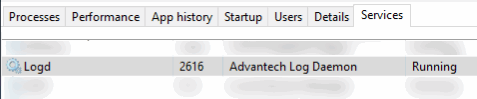

# Technical

<details>

<summary>Why does installing the DeviceOn Agent fail with error code 12007?</summary>

\
DeviceOn Agent requires the Microsoft Visual C++ Redistributable 2008, 2013, 2015 x86 packages, which will be downloaded from the Internet and set up during the installation process. If you are in an environment with limited or no Internet access, please download the [“**Agent Dependency Package**”](https://eiot.blob.core.windows.net/rmm-agent/AgentDependencySetup.exe) through an Internet connected device and install this package first.

</details>

<details>

<summary>Why can't download the DeviceOn Agent during onboarding?</summary>

\
In order to allow users to obtain the latest and stable DeviceOn Agent, the DeviceOn team will place the latest version on the cloud. When this message appears, it means that your server network cannot access the cloud or does not have network connectivity.

You could download DeviceOn Agent through your mobile device or laptop and put it in the following path. The file name must be “**AgentSetup\_x.y.z.exe**”.


```
\DeviceOn Server\server\portal\
```


</details>

<details>

<summary>Why do Acronis and Trellix installations fail?</summary>

Since the installer package require **.Net Framework 4.x** dependency, please help to confirm is .Net Framework 4.x installed on your devices.

</details>

<details>

<summary>Why can't your SMTP server (Gmail) send emails?</summary>

* **Case I: Your DeviceOn service is deployed on Azure cloud and your SMTP server adopt port 25.**

Starting on November 15, 2017, outbound email messages that are sent directly to external domains (such as [outlook.com](http://outlook.com/) and [gmail.com](http://gmail.com/)) from a virtual machine (VM) are made available only to certain subscription types in Microsoft Azure. Outbound SMTP connections that use TCP port 25 were blocked. (Port 25 is primarily used for unauthenticated email delivery.)

This change in behavior applies only to new subscriptions and new deployments since November 15, 2017.\
[Referenced site>](https://docs.microsoft.com/en-us/azure/virtual-network/troubleshoot-outbound-smtp-connectivity)

* **Case II: Send mail via Google Account**

To help keep your account secure, from **May 30, 2022**, ​​Google no longer supports the use of third-party apps or devices which ask you to sign in to your Google Account using only your username and password.

**Sign in with App Passwords**

**Tip**: App Passwords aren’t recommended and are unnecessary in most cases. To help keep your account secure, use “Sign in with Google” to connect apps to your Google Account.

An App Password is a 16-digit passcode that gives a less secure app or device permission to access your Google Account. App Passwords can only be used with accounts that have [2-Step Verification](https://support.google.com/accounts/answer/185839) turned on.

Reference: [https://support.google.com/accounts/answer/185833?hl=en](https://support.google.com/accounts/answer/185833?hl=en)

</details>

<details>

<summary>Why can some devices not power on remotely?</summary>

The remote “Power On” is leverage **Wake-on-LAN** (WoL) protocol, that’s network standard allows a computer to be turned on. Enabling Wake-on-LAN is done in two steps, **BIOS** and **Operating system** Setup. Please reference the [**site**](https://www.lifewire.com/wake-on-lan-4149800) to configure your devices.&#x20;

Second, the WoL magic packet cannot cross different network, if your server is running on public cloud, it’s not on the same network as the devices, please ensure there is an alive device that connect to cloud, through the device to broadcast magic packet. On the DeviceOn portal, go to [**Device** > **Provision** > **PowerOn**](../../web-user-interface/device-management/provision-and-configuration.md#power-on-wake-on-lan) to batch configure group devices on “**Agent Mode**”.

</details>

<details>

<summary>Why can't I remote desktop into devices?</summary>

DeviceOn uses **VNC** (Virtual Network Computing) technology for encrypted remote desktop connections. If you cannot remote desktop into a device, verify that the browser's outbound port (**6083**) and the target device's outbound port (**8022**) are open and unrestricted.

</details>

<details>

<summary>How can I enable and adjust DeviceOn agent log levels?</summary>

* For DeviceOn Agent versions greater than v1.4:

To enable more detailed logging, modify **log.ini** at

(Windows)

```
C:\Program Files (x86)\Advantech\DeviceOn Agent
```

(Ubuntu)

```
/usr/local/AgentService
```

1. Change the **`log_level` from 4 to 5**.&#x20;

```ini
#log_level=4
```

&#x20;   to

```ini
log_level=5
```

2. Save the **log.ini**

<!---->

3. Apply configuration. Restart **`logd`** service, or just reboot the device.

&#x20;   In Task Manager



&#x20;   In Services


More verbose logs will be written to:

```
C:\Program Files (x86)\Advantech\DeviceOn Agent\logs.
```

</details>

<details>

<summary>How can I collect DeviceOn agent logs and diagnostic report?</summary>

For DeviceOn Agent versions greater than v2.0.21

Default Install Path - Windows

```batch
C:\Program Files (x86)\Advantech\DeviceOn Agent
```

Default Install Path - Ubuntu

```sh
/usr/local/AgentService
```

1. Change `{Install Path}/portal/config/app.yaml` : **LogLevl** from **2** to **1**. \
   `LogLevl: 2`\
   to\
   `LogLevl: 1`\

2. Change `{Install Path}/log.ini` : **log\_level** from **4** to **5**.\
   `#log_level=4`\
   to\
   `log_level=5`\

3. Reboot the device.
4. Open DeviceOn agent portal, and sign in.
5. Run `{Install Path}/diagnostic.exe -d` (need admin privilege).

Diagnostic report will save to folder:

```sh
{Install Path}/diagnostic_report/
```


</details>

<details>

<summary>Why doesn't the Grafana dashboard display all data within the set time interval?</summary>

DeviceOn provide the Simple JSON interface to access sensor data from the edge device, there are two mechanisms to retrieve data, one is **Sampling** to scatter the value of the interval, require lot’s of computing resource of databases. The other is **Raw** to return latest raw data with **5,000** records. Both of two methods support data within **7** days only.

</details>

<details>

<summary>How can I enable or disable DeviceOn agent plugins?</summary>

* **Step 1**: Adjust configuration file on DeviceOn Agent Open **module\_config.xml** on

```
Installation path\module\
```


Adjust “ModuleEnable” to **TRUE**/**FALSE** to enable and disable.\


* **Step2:** Restart DeviceOn Agent service

Restart “**DeviceOnAgent**” to connect to DeviceOn

.png>)

</details>

<details>

<summary>How can I adjust the IP address for a standalone DeviceOn server?</summary>

DeviceOn provide advanced tool for user to adjust the IP address, please refer to [Advanced Configuration](../../user-interface-and-functions/server-standalone/server-management-tools.md#server-advanced-configuration) to update your Web Server.

</details>

<details>

<summary>How can I enable data retention policies in DeviceOn?</summary>

DeviceOn provide advanced tool for user to enable data recycling mechanism., please refer to [Advanced Configuration](../../user-interface-and-functions/server-standalone/server-management-tools.md#server-advanced-configuration) to enable.

</details>

<details>

<summary>How can I enable and reduce potential data loss from the DeviceOn agent?</summary>

The DeviceOn Agent has Zero-Downtime technology to prevent data loss. Data is cached in the database via the DataSync plugin. However, data can still be lost if the system is powered off or the agent is forcibly closed.

To guarantee zero data loss even during harsh shutdowns:

* **Step 1**: Enable “KeepLostConnect” to 1 on the **DataSync.ini**.

Windows:

```bash
C:\Program Files (x86)\Advantech\DeviceOn Agent\
```

Linux:&#x20;

```
/usr/local/AgentService/
```


* **Step 2**: To reduce data loss when transmitting over MQTT and detect connection losses faster, set \<sensor\_qos> to 1 in the agent\_config.xml file. This will change the QoS (quality of service) level from the default of <mark style="color:blue;">**0 to 1**</mark>.


</details>

<details>

<summary>How can I access DeviceOn server logs and diagnostic service information?</summary>

For DeviceOn standalone servers, use the [Diagnostic Tool](../../user-interface-and-functions/server-standalone/server-management-tools.md#server-diagnostic) to check the health of each service and collect log files. Run the tool on the DeviceOn server. It will generate a log.zip file containing debug logs for all services. Please send this <mark style="color:blue;">**log.zip**</mark> file to your technical support representative to help troubleshoot any issues.

</details>

<details>

<summary>Why do remote desktop and screenshot functionality not work on Ubuntu 22.04?</summary>

Screen Share (**Remote Desktop**, **Screenshot**) not working in **Ubuntu 22.04**.\
The issue with **Ubuntu 22.04** is using a display feature called **Wayland**. Wayland is not supporting to screen share by default. In previous ubuntu version we had **Xorg** for display feature.

Disable Wayland on Ubuntu 22.04 step-by-step instructions.

*   **Step 1**:\
    The default display manager for the GNOME desktop environment is GDM3. Therefore, we will edit the **/etc/gdm3/custom.conf** file to either disable or enable Wayland.

    ```bash
    $ sudo nano /etc/gdm3/custom.conf
    ```
* **Step 2**:\
  In custom.conf, uncomment this line **#WaylandEnable=false** to disable the Wayland.\
  
*   **Step 3**:\
    After saving and exiting the custom.conf, restart GDM3, or reboot your Ubuntu 22.04 desktop for the changes to take effect.

    ```bash
    $ sudo systemctl restart gdm3
    ```
* **Step 4**:\
  After disabling the Wayland display server, the gear button doesn’t show up at all.

</details>

<details>

<summary>Why does Microsoft Excel claim the XLS file exported from DeviceOn is broken?</summary>

This error can occur due to Microsoft Windows security settings that block opening of downloaded files to prevent potential threats.


If you receive an error when opening an exported XLS file, right-click the file, select Properties, and click **Unblock**. This will allow the file to be opened.

</details>


