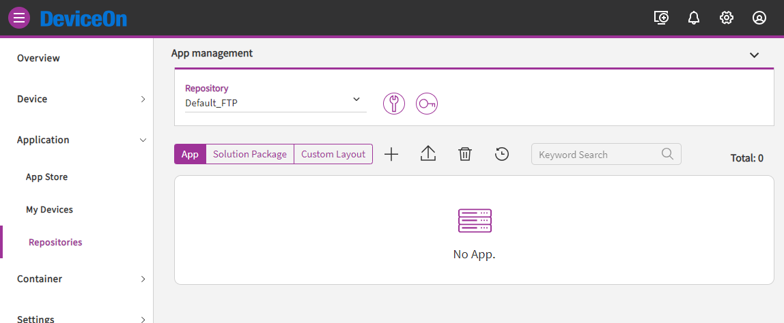
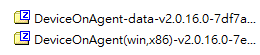
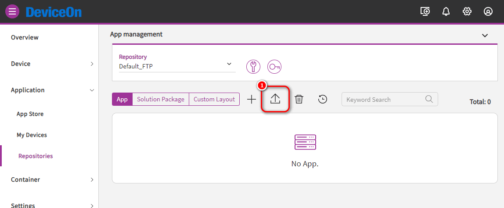
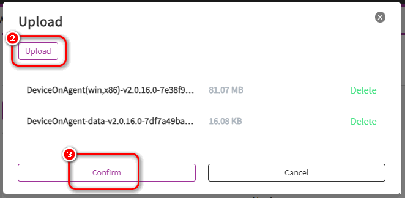
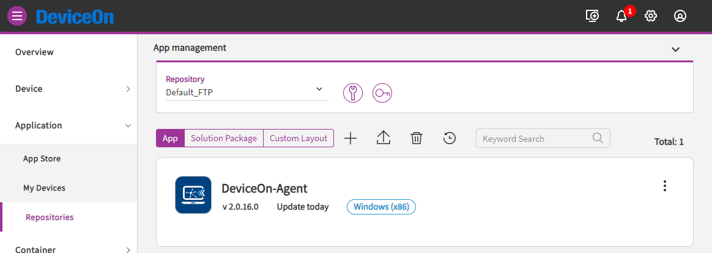
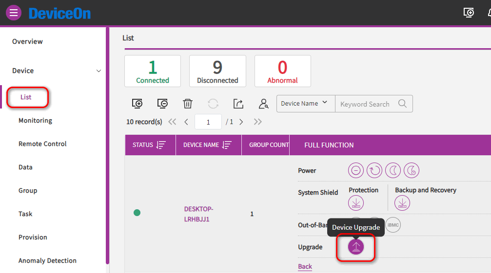

# Upgrade DeviceOn Agent in On-premises DeviceOn Server

Here is an example description of how to upgrade DeviceOn Agent in On-premises DeviceOn Server, for devices which do not have internet connectivity.

In closed network environment. On-premise DeviceOn Server can't download the latest released DeviceOn Agent through internet. Maintainer can upload DeviceOn Agent package manually then upgrade managed devices.

## Prerequisite

* A running DeviceOn Server.
* A device with installed DeviceOn Agent, that connects to the DeviceOn server.
* DeviceOn Agent package files.

## Upload DeviceOn Agent package

<figure><figcaption>
On-premises DeviceOn Serve, the App Store will be empty.
</figcaption></figure>

Prepare DeviceOn Agent package files:&#x20;

* `DeviceOnAgent({PLATFORM})-{VERSION}-{HASH}.zip`&#x20;
* `DeviceOnAgent-data-{VERSION}-{HASH}.zip`

<figure><figcaption>
Using DeviceOn Agent 2.0.16 as example
</figcaption></figure>

<figure><figcaption>
Upload DeviceOn Agent package files to Repository
</figcaption></figure>

<figure><figcaption>
Choose DeviceOn Agent package files
</figcaption></figure>

After upload process finished, DeviceOn Agent list in Repository

<figure><figcaption></figcaption></figure>

## Upgrade DeviceOn Agent

<figure><figcaption>
Upgrade selected device
</figcaption></figure>
