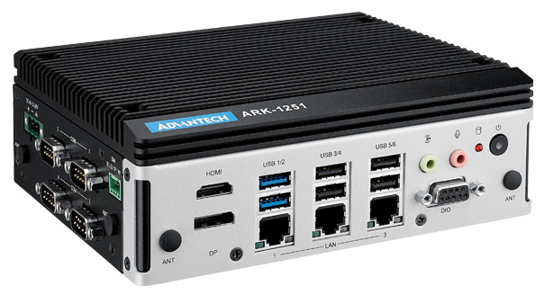

# Advantech EdgeBMC

## Revolutionizing Edge Computing Management

The Advantech EdgeBMC introduces a cutting-edge hardware solution for remote management tailored to the needs of edge computing. This system harnesses the power of Out-of-Band Management (OOBM), creating a dedicated and secure management channel that operates independently of the traditional internet connection. This innovation allows for unprecedented remote management capabilities, enabling administrators to maintain control over devices even in scenarios where the operating system or BIOS is unresponsive.

### Always-On Networking

#### Ensuring 24/7 Network Viability and Manageability

To guarantee around-the-clock network performance and manageability, it is crucial to establish a strong networking connection. This can be achieved by integrating both in-band and out-of-band subsystems. Implementing these subsystems ensures continuous network operation and facilitates effective network management, regardless of the status of the primary network infrastructure.

### Shorten MTTR

**Remote Monitoring and Control at the Hardware and Firmware Levels**

Enable remote monitoring and control capabilities at both the hardware and firmware levels for your device. This functionality is available even when the system is powered off or out of service, as long as it is connected to AC power. This feature ensures continuous access and control over your device for maintenance, updates, and troubleshooting purposes, enhancing the reliability and efficiency of your operations.

### Cybersecurity Protection

#### Implementing PFR with Advantech EdgeBMC

Advantech EdgeBMC employs Platform Firmware Resilience (PFR) to ensure the integrity and security of system firmware. It integrates a Root of Trust (RoT) and adheres to NIST 800-193 guidelines for authentication. This approach assures comprehensive protection, detection, and recovery of firmware components.

### Seamless Integration with DeviceOn

#### Advantech EdgeBMC Integration with DeviceOn

Advantech's EdgeBMC offers complete integration with DeviceOn, empowering users with full control over the current features of version 1.0. These features include:

1. **Sensor Monitoring (Out-of-Band)**

<figure><figcaption></figcaption></figure>

2. **BIOS Console Redirection**

<figure><figcaption></figcaption></figure>

3. **Power Management**

Looking ahead, Phase 2 aims to enrich this ecosystem by providing custom APIs. These APIs are designed for effortless integration with the next-gen remote management platforms, aligning with user preferences for enhanced flexibility and control.

## Supported Hardware

#### [`AFE-E350`](https://www.advantech.com/zh-tw/products/8a011db5-af04-48dc-bcd5-75a4bdd38c4d/afe-e350/mod_6385cb7d-2174-4788-8ccb-371732938583)

<figure><figcaption></figcaption></figure>

Intel® Atom® x6000E series and Celeron® J series 3.5" SBC

* Atom® x6000E series and Intel® Celeron® J and N series with Quad/Dual Cores, TDP 6-12W
* 3 simultaneous displays: LVDS/HDMI/DP
* 3 GbE support support TSN & PoE
* 4x RS232/422/485, 6x USB, 2x CANBus, 1x I2C/SMBus
* 3 Expansions: M.2 E-Key, B-Key, M-Key
* Supports EdgeBMC & Software APIs, DeviceOn

#### <mark style="color:blue;">`ARK-1251`</mark>

<figure><figcaption></figcaption></figure>

Intel® Core Ultra U series processor with thee LAN, four COM, HDMI, DP, GbE, GPIO, Remote Switch, USB x 6

* Intel® Core Ultra 5/Ultra 7 Processor
* DDR5-5600 SO-DIMM memory support up 96G
* M.2 E Key, B Key and M Key for storage and wireless module installation
* Up to 3 x Intel GbE, 4 x serial ports, 8-bit DIO, optional CANBus
* Dual displays with 1 x 8K HDMI + 1 x 4K DP
* 2 x USB 3.2 and 4 x USB 2.0
* 12V \~ 28V wide range power input
* -20 \~ 60 °C extended operating temperature

### Configuration?

No matter if you're using in-band or out-of-band communication, setting up is effortless. Simply install the SUSI driver and DeviceOn Agent on the in-band OS. Once connected to the DeviceOn Server, it automatically initiates a secure provisioning handshake with the Edge BMC. This process utilizes TLS v1.3 encryption, guaranteeing the security of your information.&#x20;


#### DeviceOn Server Deployment on Locally or Public Cloud

For the EdgeBMC, the DeviceOn server can be deployed locally or in the cloud, and it is not limited to the same network segment as the device. The only requirement is that the device has an available outbound connection on port 80 or 443.


After successfully completing the device onboarding process, the EdgeBMC interface is activated, indicated by the EdgeBMC icon lighting up.

<figure><figcaption></figcaption></figure>

